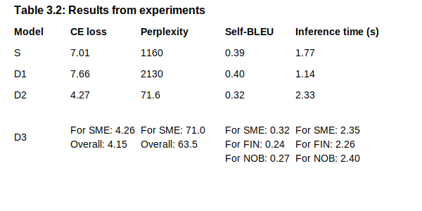

## Sami Plagiarism Detection Application

In the application, the Sami model (https://huggingface.co/rpa020/D2) generates the word embeddings as vector
representation for each sentence within a document. These vectors are subsequently stored within a dedicated vector database, ChromaDB. The metadata includes a unique identifier for each vector, the source document’s
path within the server storage, and the original textual sentence that the vector
represents. 

The system currently has two distinct collections: a large one containing the data
utilized for constructing the SALT dataset and a smaller one consisting of a
limited corpus of Sami documents used for testing purposes. Since the SALT data is particularly large, only testdata related to the expirements is provided in this folder as a demo. Contact me on ronny.paul1999@gmail.com to retrieve full dataset. 

## How to run application

`python app.py model_path tokenizer_path database_path`

* Models can be downloaded from huggingface, https://huggingface.co/rpa020.
* tokenizer is included in this folder
* Database (chroma) is also included in this folder. Because the dataset from SALT is large, it only contains testdata related to expirements.

## Model Performance

The experiments were done on three different decoder-only models and a
single sequence-to-sequence model (https://huggingface.co/rpa020). Table shows the individual models
performance in cross-entropy loss, perplexity, self-BLEU and inference time.
Model S represents the sequence-to-sequence pegasus model with random
initialized weights, i.e., it has no prior knowledge. D1 represents the decoder-
only BLOOM model, also initialized with random weights. D2 and D3 are also
BLOOM models but have prior pretraining knowledge in Finnish. D2 is trained
with Northern Sami only, while D3 has performed joint multilingual training
in Northern Sami, Finnish, and Norwegian.

